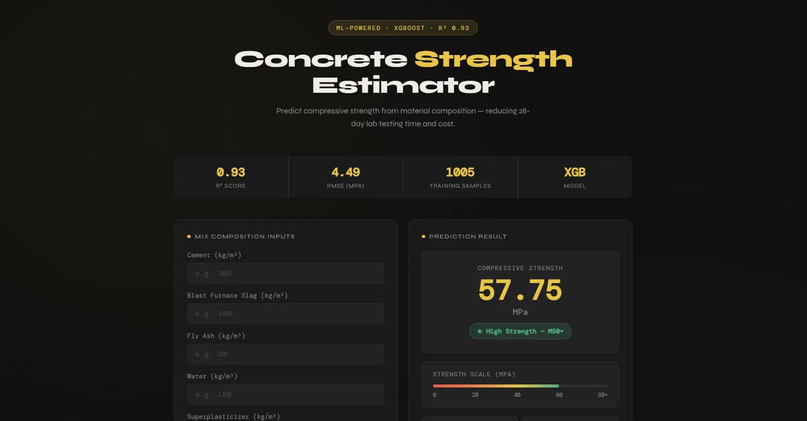
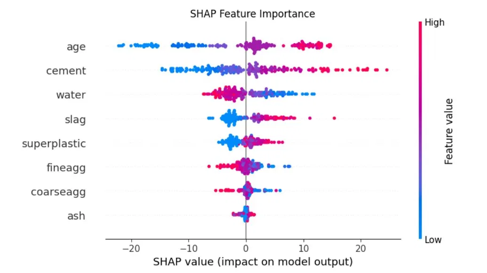
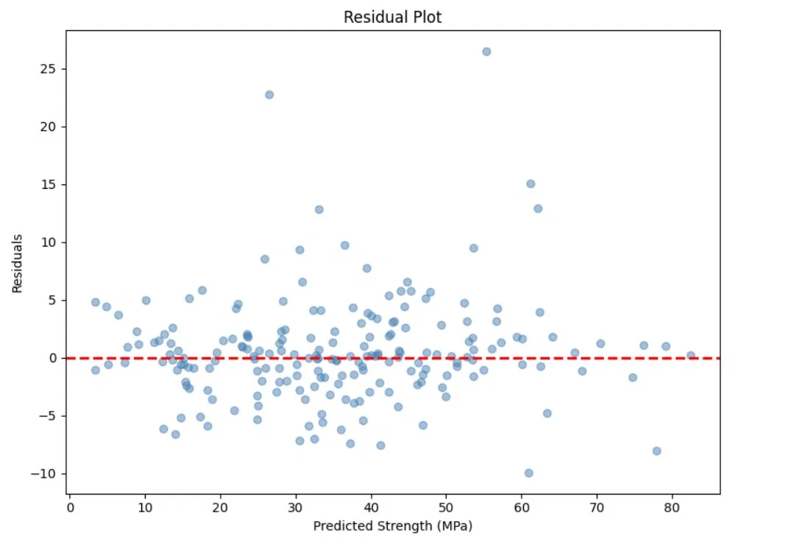

# 🏗️ Concrete Compressive Strength Prediction

> Predicting concrete compressive strength (MPa) from material composition using Machine Learning — reducing 28-day lab testing time and cost.

## 🔴 Live Demo
**[https://concrete-strength-prediction-g6zw.onrender.com](https://concrete-strength-prediction-g6zw.onrender.com)**

---

## 📌 Problem Statement
Concrete compressive strength testing in civil engineering requires 28 days of physical lab testing. This project builds an ML system to estimate strength from material composition early — helping construction engineers optimize mix design and reduce testing costs.

---

## 📸 Screenshots

### Flask App UI

### SHAP Feature Importance

### Actual vs Predicted

---

## 📊 Dataset
- **Source:** UCI Machine Learning Repository
- **Size:** 1030 rows, 8 features, 1 target
- **Features:** Cement, Blast Furnace Slag, Fly Ash, Water, Superplasticizer, Coarse Aggregate, Fine Aggregate, Age
- **Target:** Compressive Strength (MPa)

---

## ⚙️ ML Pipeline

| Step | Detail |
|------|--------|
| Data Cleaning | Removed 25 duplicates |
| Outlier Treatment | IQR capping on water and superplasticizer |
| Skewness Treatment | log1p on age (3.25 → 0.006) |
| Scaling | StandardScaler |
| Models Compared | Linear Regression, Decision Tree, Random Forest, XGBoost |
| Explainability | SHAP values used to interpret feature influence on predictions |
| Best Model | XGBoost (Hypertuned with GridSearchCV) |

---

## 📈 Results

| Model | R² Score | RMSE |
|-------|----------|------|
| Linear Regression | 0.8016 | 7.693 |
| Decision Tree | 0.8856 | 5.842 |
| Random Forest | 0.9083 | 5.229 |
| **XGBoost (Tuned)** | **0.9326** | **4.486** |

---

## 🔍 Key Findings
- **Age** is the most important feature — concrete gains strength through hydration over time
- **Cement** content is the strongest ingredient predictor
- Nonlinear ensemble models significantly outperform linear regression
- Water-cement ratio is the critical engineering factor affecting durability and compressive strength

---

## 🚀 Deployment
- **Framework:** Flask
- **Platform:** Render
- **Features:** Grade classification (Weak / Moderate / Standard / High Strength), Strength scale visualization

---

## 🛠️ Tech Stack
- Python
- Pandas
- Scikit-learn
- XGBoost
- SHAP
- Flask
- Render

---

## 📁 Project Structure

    app.py                                → Flask application
    concrete_model.pkl                    → Trained XGBoost model
    concrete_scaler.pkl                   → StandardScaler
    requirements.txt                      → Dependencies
    templates/index.html                  → Frontend UI
    concrete_strength_prediction.ipynb    → Full notebook
    screenshots/                          → App and plot screenshots

---

## 🔮 Future Improvements
- Add CI/CD pipeline for automated deployment
- Docker containerization
- Real-time concrete mix optimization recommendations
- Pipeline-based preprocessing with sklearn Pipeline
- API endpoint for integration with construction management systems

---

## 👩‍💻 Author
**Mythili P** · Data Science Portfolio Project
